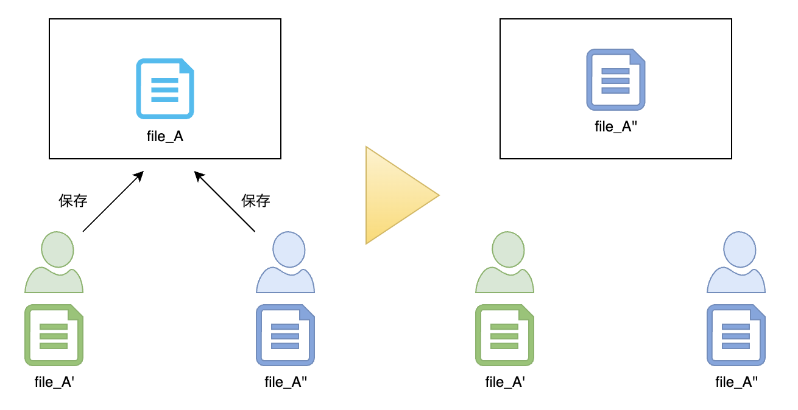
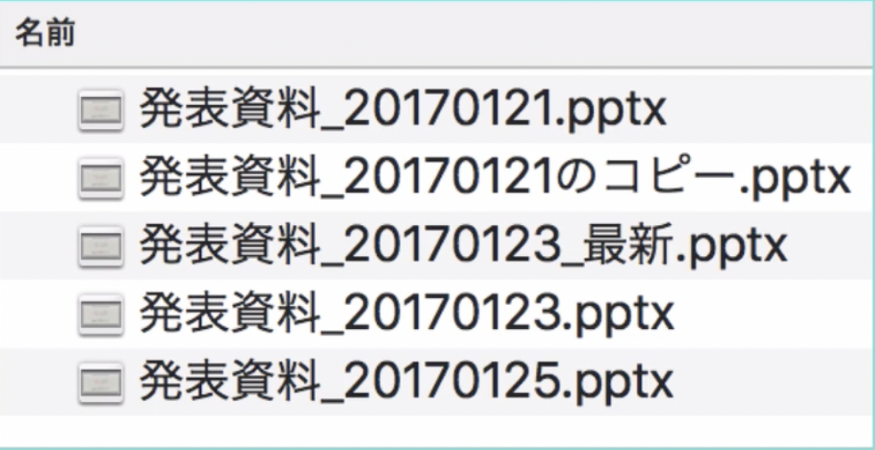
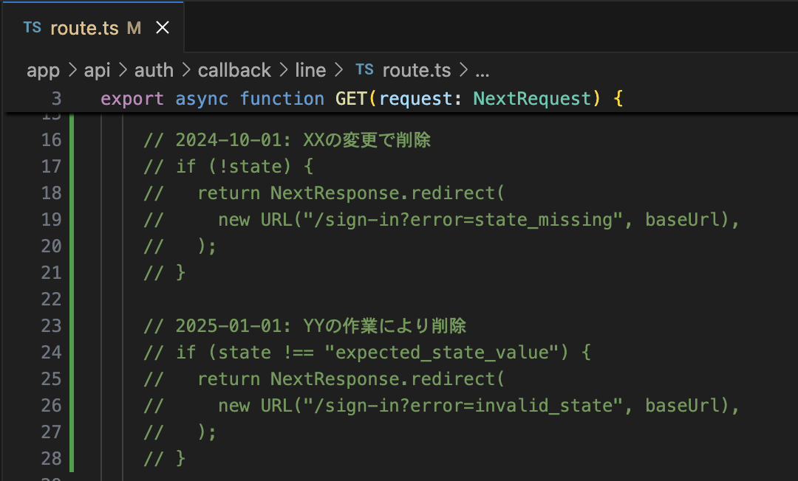
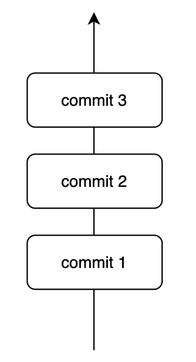
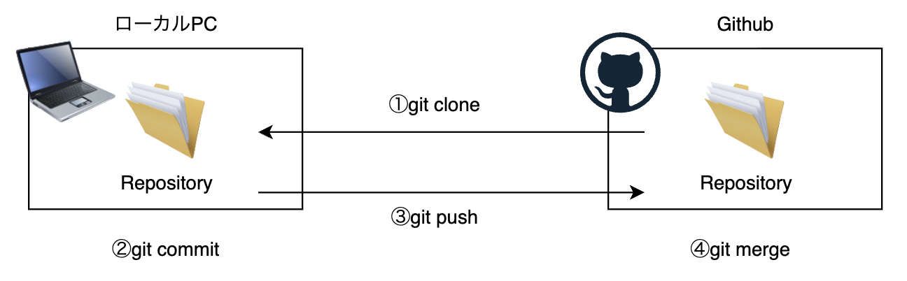

# Git基礎

## Gitとは何か

__ファイルの変更管理を行う仕組み（ツール）のこと__

## Githubとは何か

__Gitを使った資材管理サービスのこと__

## なぜGit（変更管理）が必要なのか

### Gitを使わないとどうなるか

__共有リソース管理__:

ファイルの修正を例に図解すると、下の図では、片方が行った修正がもう片方のファイル保存により上書き（無かったこと）になってしまっています。

__手動でのバージョン管理__:

バージョン管理が適切に行われていないと、図のように最新断面がわからなくなり、混乱が生じます。

__手動での変更管理__:

たまに見る光景として、ファイル内でコメントアウトなどを駆使し手動で変更管理を行なっているものがあります。\
このような管理はコード量が肥大化し、保守コストが膨れ上がるだけなので、避けるべきです。

### Gitを使うとどうなるか

Gitの機能により、上に挙げたようなバージョン管理・変更管理の課題が解消します。

Gitでは、`commit`と言われる単位で、スナップショット（断面）を管理し、変更を記録します。\
これにより、「いつ」「だれが」「なにを」変更したのかが全て追跡可能となります。

また便利なこととして、例えば以下のようなことができます。
- 特定の`commit`を取り消す
- 特定の`commit`まで断面を戻す

### Git操作の流れ

Gitを使った開発での操作手順は、ざっくり（ほんとざっくり）以下の4Stepです。

__1. git clone__:
Githubで管理されている資源をローカルにもってくる\
__2. git commit__:
ローカルで行った変更を断面として固定する\
__3. git push__:
ローカルのcommitをGithub（リモート）に送信する\
__4. git merge__:
送信したcommitをGithubのリポジトリ本体に取り込む

## Gitを始める

### インストール

1. Gitのインストール
    - Mac: 元々入っているので不要
    - Windows: [公式サイト](https://gitforwindows.org/)からインストール
2. Githubアカウントの作成
    - [公式サイト](https://github.com/)から作成
2. VS Code（エディタ）のインストール
    - [公式サイト](https://code.visualstudio.com/)からインストール

### SSH Keyの登録

こちらを参考にGithubに公開鍵を登録してください
- [GitHubにSSH鍵を追加する](https://qiita.com/floginal/items/32b60c495d2792f9bbdb)

### Gitユーザー名、メアド設定

こちらを参考にGitのユーザー名、メールアドレスを設定してください
- [git ユーザー名、メールアドレスの設定](https://qiita.com/ucan-lab/items/aadbedcacbc2ac86a2b3#git-%E3%83%A6%E3%83%BC%E3%82%B6%E3%83%BC%E5%90%8D%E3%83%A1%E3%83%BC%E3%83%AB%E3%82%A2%E3%83%89%E3%83%AC%E3%82%B9%E3%81%AE%E8%A8%AD%E5%AE%9A)

## 参考

- Udemy: [Git： もう怖くないGit！チーム開発で必要なGitを完全マスター](https://www.udemy.com/course/unscared_git)
- 書籍: [いちばんやさしいGit&GitHubの教本 人気講師が教えるバージョン管理＆共有入門 「いちばんやさしい教本」シリーズ](https://www.amazon.co.jp/%E3%81%84%E3%81%A1%E3%81%B0%E3%82%93%E3%82%84%E3%81%95%E3%81%97%E3%81%84Git-GitHub%E3%81%AE%E6%95%99%E6%9C%AC-%E4%BA%BA%E6%B0%97%E8%AC%9B%E5%B8%AB%E3%81%8C%E6%95%99%E3%81%88%E3%82%8B%E3%83%90%E3%83%BC%E3%82%B8%E3%83%A7%E3%83%B3%E7%AE%A1%E7%90%86%EF%BC%86%E5%85%B1%E6%9C%89%E5%85%A5%E9%96%80-%E3%80%8C%E3%81%84%E3%81%A1%E3%81%B0%E3%82%93%E3%82%84%E3%81%95%E3%81%97%E3%81%84%E6%95%99%E6%9C%AC%E3%80%8D%E3%82%B7%E3%83%AA%E3%83%BC%E3%82%BA-%E6%A8%AA%E7%94%B0%E7%B4%8B%E5%A5%88-ebook/dp/B07LBSWJNP/ref=sr_1_4_sspa?adgrpid=70877007059&dib=eyJ2IjoiMSJ9.fo1SpBLFfztpM8AKVaZyVhYzgHh3jALr-yT6Fs9JjdWFWXIi8Qt5FaDn20g5qviU4ume1V6pcHMYJIg7F1-QSF7LcMoiAjSxm42ufW4zSoCHyj9khBd1tWp0C3XLFDwpGQrFdOdvouAfPF4pb21Q4TM6IjHjxcwJprM3LqNPag0olWSf7y9e8ETzxY1MNNCeHmZr4p_DKZCW3VogwueRCW8q-GqU2a88tFOYPnRm-zSWgZgAM5dx7d_52V2Jpbc2RLOo9B-vHyBHw3Ntpn_k-WqX3OKL03Tky2RgaklIoDc.5dEgCbR9fj8wYm-QcV1pmVjhUyUZ7oR5aMdml3Aa8A4&dib_tag=se&hvadid=679018776601&hvdev=c&hvexpln=0&hvlocphy=1009318&hvnetw=g&hvocijid=16014674922879523663--&hvqmt=e&hvrand=16014674922879523663&hvtargid=kwd-762955829998&hydadcr=15818_13711658&jp-ad-ap=0&keywords=github+%E6%9C%AC&mcid=8b8c8ff1015932e194b3a771c1b0322a&qid=1753540988&sr=8-4-spons&sp_csd=d2lkZ2V0TmFtZT1zcF9hdGY&psc=1)
- Qiita: [【初心者向け】GITとは何か？GITの概念を解説](https://qiita.com/a_goto/items/0fe40b17105d1ac1c40b)

--\
NEXT > [02_GitFlow](../02_GitFlow/README.md)

