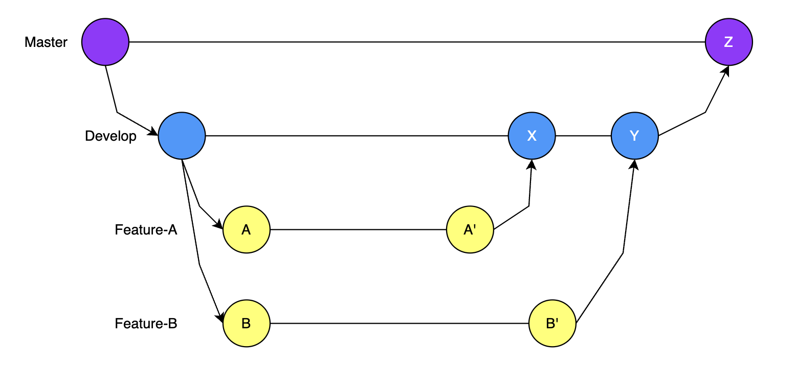

# Gitを使った開発フロー

__複数の開発者で同じリソースの修正を行うときは、`branch`を使って並行開発を行います__\
__基本的には下に書くGit Flowに従ってブランチ管理が行われます__

## branch（ブランチ）とは

作業用に分岐させた断面、のことです。

## PR（プルリクエスト）とは

自分が修正した内容（commit）をリポジトリに取り込んでもらう依頼をすることです。

## Git Flow

図では、Master, Develop, Feature-A, Feature-Bの4つのブランチが登場しています。

__Masterブランチ__: 本番環境にデプロイされる断面\
__Developブランチ__: 開発環境にデプロイされる断面\
__Featureブランチ__: 個々の開発を行うための断面

図中の各ポイントについて説明します。

- A: Developブランチから`git checkout -b Feature-A`で、開発用ブランチを作成
- A': Feature-Aブランチで行った修正を`git add`, `git commit`でcommitを作成（断面を固定）
- X: A'のコミットを`git push`で送信、PRをマージすることによりDevelopブランチに変更が取り込まれる
- Y: Feature-Bブランチで行った修正がDevelopブランチに取り込まれる
- Z: X, Yで取り込んだ修正が、Masterブランチに取り込まれる

## 一通りの開発の流れ

1. リポジトリをローカル環境にクローン: `git clone <Repository>`
1. 開発用ブランチを作成: `git checkout -b <branch name>`
1. ローカルで環境構築を行う
1. 実際に開発を行う
1. ローカルで動作を確認し、問題ないことを確認する
1. ローカルで自動テストを実施し、問題ないことを確認する
1. 修正内容をステージする: `git add`
1. 修正内容のコミットを作成する: `git commit -m <comment>`
1. 作成したコミットをリモートリポジトリにプッシュする: `git push -u origin <branch name>`
1. PRを作成する
1. PRがレビューされ、フィードバックに従い対応を行う
1. レビュー完了後、PRがマージされる

## コンフリクトの解消
あとで書く・・・

## 実際に開発をしてみる

forkしたaction-boardにPR飛ばしてもらって遊ぶのとか良さそう

## 参考
- Qiita: [Git-flowって何？](https://qiita.com/KosukeSone/items/514dd24828b485c69a05)
